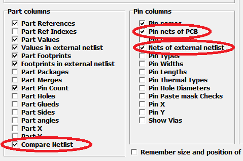

### `Loading extern netlist`

In Infobox, you can upload a netlist from another project or a previous version of the current project in PADS-PCB format. This will make it possible to compare the list of parts on the printed circuit board with the list of parts in the netlist by three attributes: RefDes, Value, Footprint. It will also provide an opportunity to compare pin nets and see discrepancies between netlists. In the InfoBox settings, select the visibility of the `Compare Netlist` column, `Pin nets of PCB` column and `Nets of external netlist` column then there select Load Netlist in the drop-down list as shown in the screenshot.

When you upload a netlist, the comparison result will be displayed in the CNetlist column for each part. The result can take the following values:

1) `only on the board`
2) `only in netlist`
3) `footprint only`
4) `value only`
5) `footprint & value`
6) `all matches`

We already considered this in the previous paragraph. Now we’ll learn to monitor the differences in the list of pins between the current project and the loaded netlist. Go to the PINS tab and right-click on the menu `Loading nets from netlist`. Next, two dialog boxes with options will appear. For an absolutely complete comparison of pin networks, select NO in response to the first dialog box that appears before starting the download. (for small projects, it makes no sense to ignore the connection poles of two-pin parts). After it, a second dialog box will appear, here for a complete analysis we click - YES. The loading of chains from an external netlist will begin. This may take some time and then the result is displayed in the Net-NL column. Now all external netlist nets are loaded into the Net-NL column, and project nets are displayed in the NET-PCB column. Lines with differences in the pin nets became yellow in order to be better visible. It would be nice to filter these lines and highlight their pins. Fortunately, there is such an opportunity in Infobox. To do this, simply left-click on the search line of the Net-NL column and Infobox will filter the yellow lines, leaving only them in the window.

