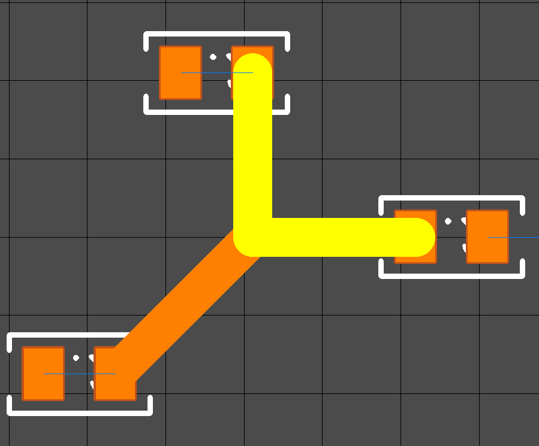
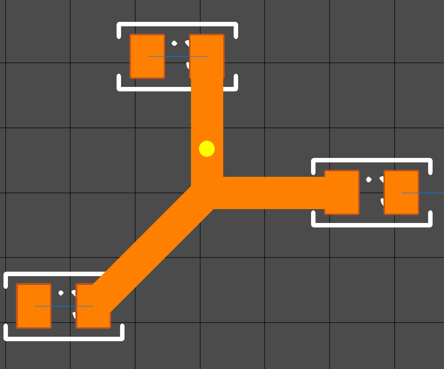

Sometimes you need to redirect the route to another pin. Now, with a simple example, I will show you how to do it.
We have a node of three segments. To understand where the trace is and where the branch click on any segment and press T on the keyboard. The trace or branch will be fully highlighted. If the track goes from pin to pin, then this is the trace.

And this is a branch, since it ends on a node of another route or branch.

To turn the top segment of a trace into a branch, first create an additional vertex on it.

Now you need to delete this segment.

Now the selected node needs to be moved again to the same node using the F4 key.

Now the trace looks like this:

# [Return](How_to.md)
