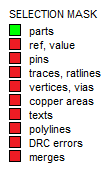

### How to edit ref and value sizes?

You can specify the uniform size and thickness of the strokes of reference designation or values for a group of parts. Make a mask like in the picture by clicking on the `parts` icon while holding down the CTRL button. 

Now, with the mouse selection frame, you can select all the details of the printed circuit board. Do not forget that the visibility of the top_copper layer should be if you want to select parts on the top side of the board. Similarly with bottom_copper visibility for parts on the underside. When parts are selected press the F9 Edit Silk button and a new editing menu screen will open.

* `F1` - sets the width of the silk-screen lines to the default value that is set in the CAM dialog box of the settings file gerber (minimum silkscreen line width).
* `F2 F3` - makes silk lines visible or invisible on the board and in gerbers.
* `F5` - opens the reference properties dialog
* `F6` - opens the value properties dialog
* `F7 F8` - makes part values visible or invisible.
* `F9 or ESC` - return to the previous menu

[return](How_to.md)
